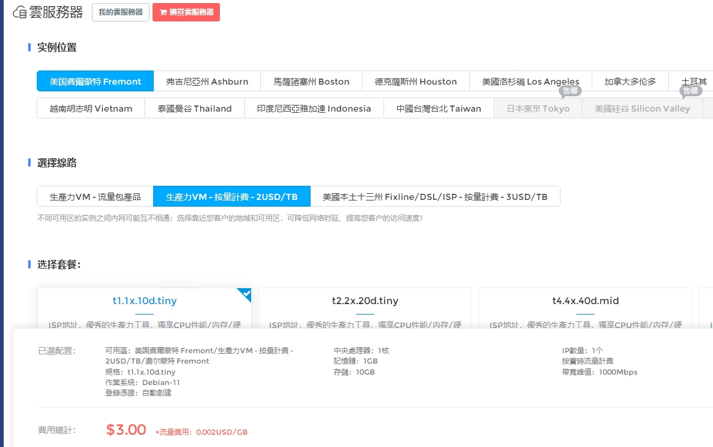
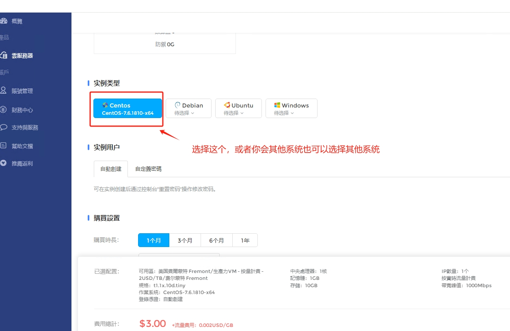

首先先购买国外服务器，有住宅ip的服务器
地址是：https://ipraft.com/?i71b7cf

## 购买服务器图片演示

  

  

然后下载FinalShell连接你的虚拟器

下载地址（windows版本）是：http://www.hostbuf.com/downloads/finalshell_windows_x64.exe

其他版本下载地址是：https://www.hostbuf.com/t/988.html

x-ui安装命令（可以去B站搜索视频：https://www.bilibili.com/video/BV1FB4y1p7uo/?share_source=copy_web&vd_source=f34b2c55dc1c7c8c0937e65e4d3ab5ee）

这个安装命令是最简洁最新的

bash <(curl -Ls https://raw.githubusercontent.com/vaxilu/x-ui/master/install.sh)

小白的话就看我解说安装，（切记不能按删除键，按完无法修改）

首先输入Y确定安装，然后里面有中文提示，输入账号，输入密码，输入端口号，然后你的服务器加你刚才的端口号就可以访问了

如果无法访问就是防火墙开开通端口，要么关掉防火墙，设置完防火墙记得重启才能生效！

