## 郑重申明：本文章只对合法合理做tiktok视频运营的用户做学习交流使用，有其他使用不当的违规违法行为后果自负！

## 1、安装不了支持远程付费
微星： lhz9947

# 购买服务器图片演示

1、选择服务器
我选择的服务器1：https://ipraft.com/?i71b7cf

服务器2：https://console.evoxt.com/aff.php?aff=4912

  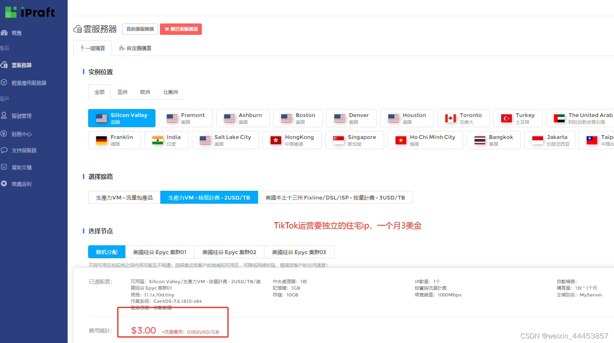

  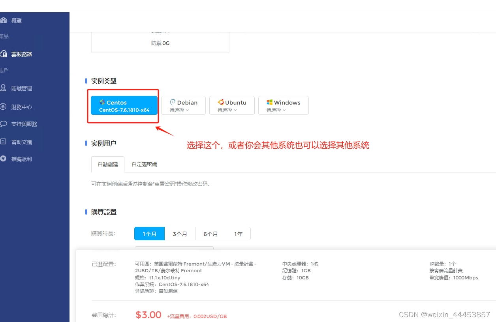

  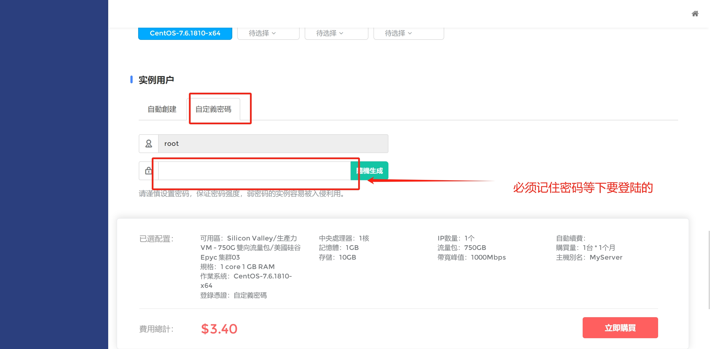

然后下载FinalShell连接你的虚拟器

下载地址（windows版本）是：https://www.hostbuf.com/t/988.html

其他版本下载地址是：FinalShell SSH工具,服务器管理,远程桌面加速软件,支持Windows,macOS,Linux,版本4.3.10,更新日期2023.12.31 - FinalShell官网

  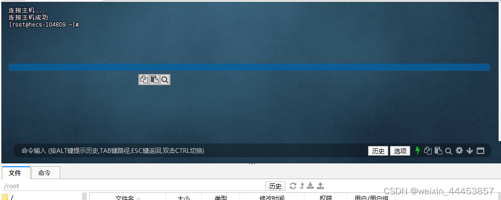

# 二选一  安装3x-ui面板 或者按安装 X-UI面板  或者去问ai怎么用 3x-ui 或者bibi看视频
安装命令： bash <(curl -Ls https://raw.githubusercontent.com/mhsanaei/3x-ui/master/install.sh)

  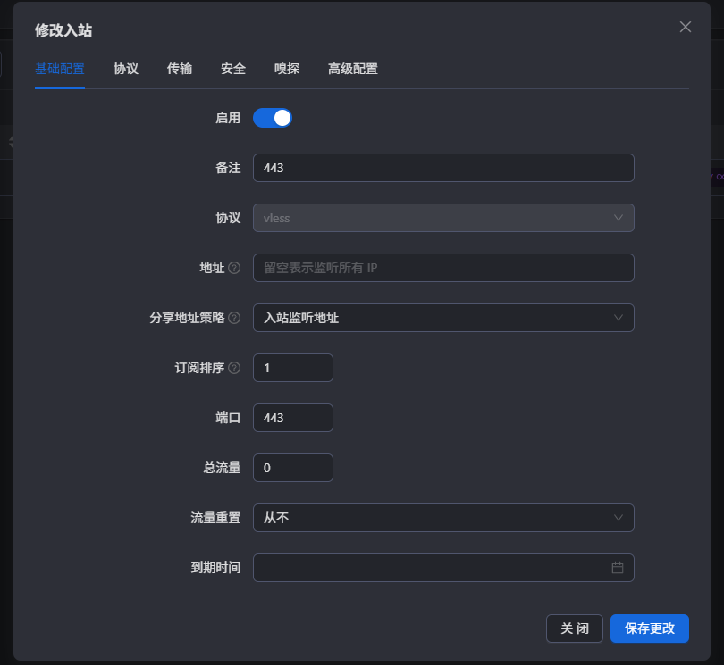

  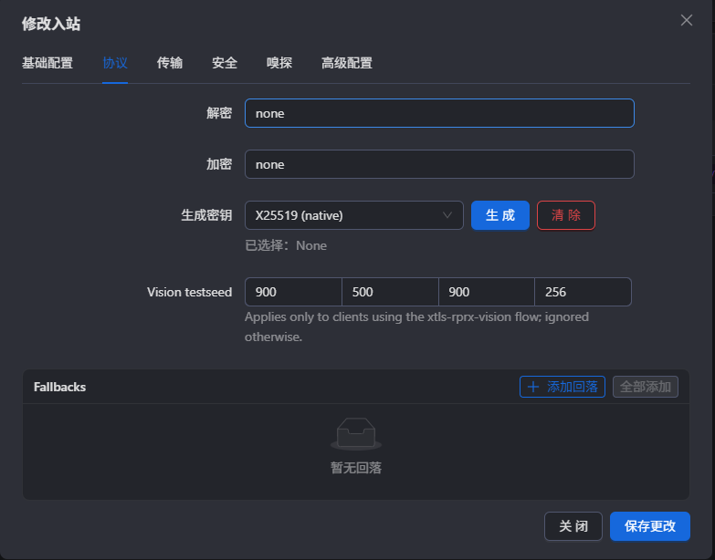

  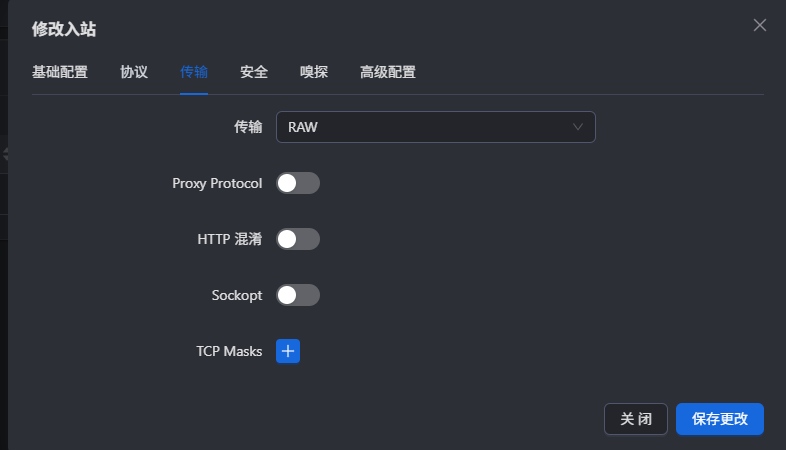

  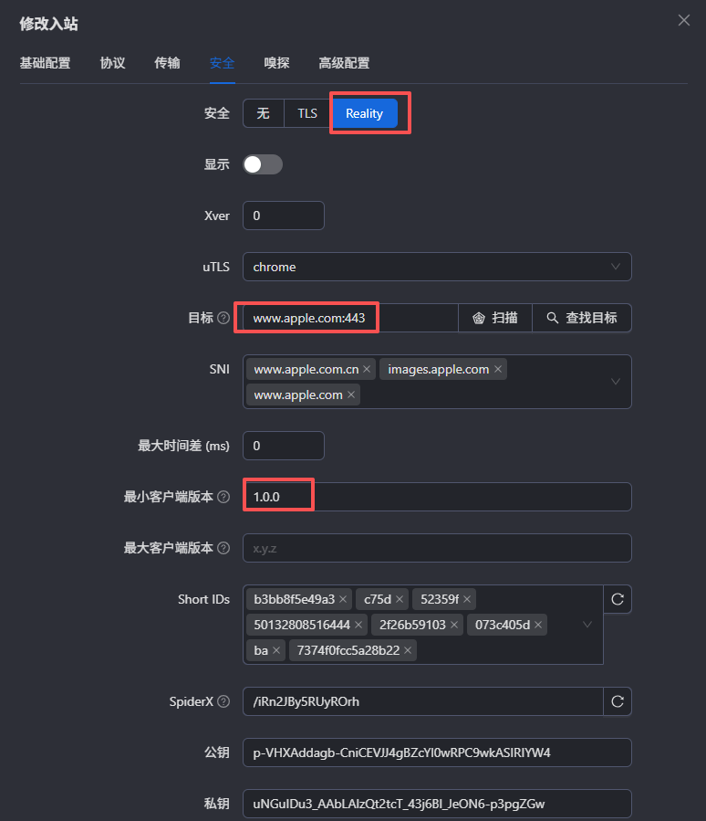

  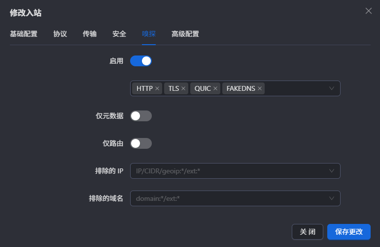

  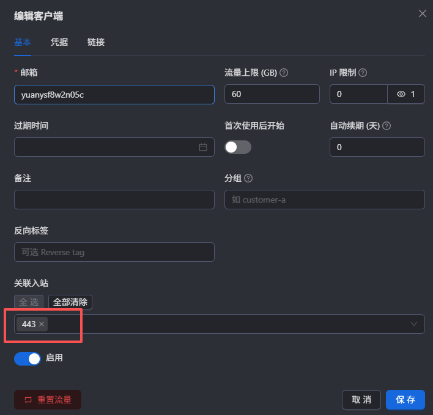

  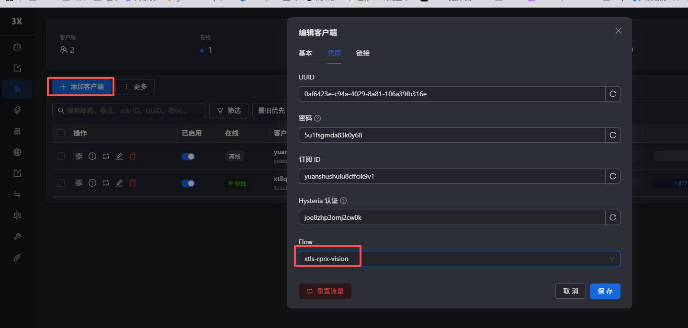

# 二选一  安装X-UI面板命令
安装命令：  bash <(curl -Ls https://raw.githubusercontent.com/vaxilu/x-ui/master/install.sh)
英文版本：bash <(curl -Ls https://raw.githubusercontent.com/FranzKafkaYu/x-ui/master/install_en.sh)

要关闭防火墙，或者开通端口才能访问地址
对于使用firewalld的CentOS 8及以上版本：
停止防火墙服务:

sudo systemctl stop firewalld

禁用防火墙服务的自启动:

sudo systemctl disable firewalld

确认防火墙已关闭:

sudo systemctl status firewalld

安装完之后输入Y，账号，密码，端口，然后x-ui start （要关闭防火墙，或者开通端口才能访问地址）然后你的服务器ip加你的端口号，我的是7004

  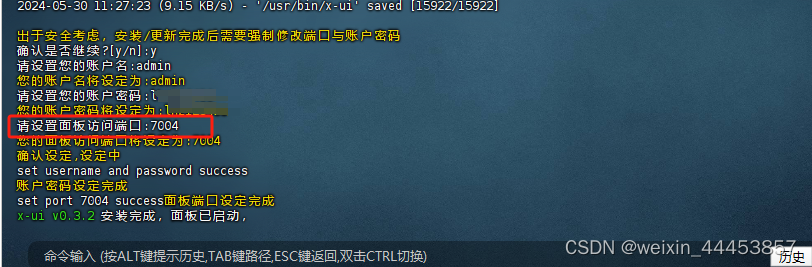

  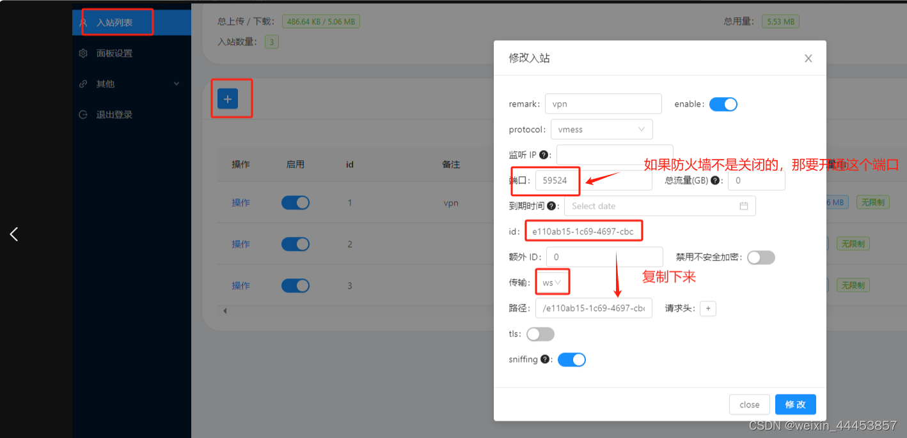

  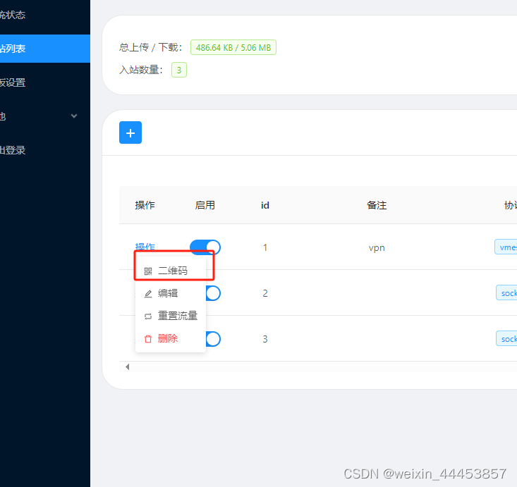

注意重要内容
三、手机端配置：最好是ios系统，基本思路就是把手机重置了把能共享、定位的功能都关了，再把手机的语言和时区设置成你想运营的那个地方的一致就行了。（手机端环境一定要配置好，环境不吻合视频容易限流或封号）尽量一个tk号一固定ip不要到处飘！ios手机不能插手机卡！

然后去地址测一下你的IP是否正常,输入你购买的服务器IP，如果显示ip不行可以退款，1天内可以退款，然后重新买，地址是：[http://www.ping0.cc](https://ping0.cc/)

  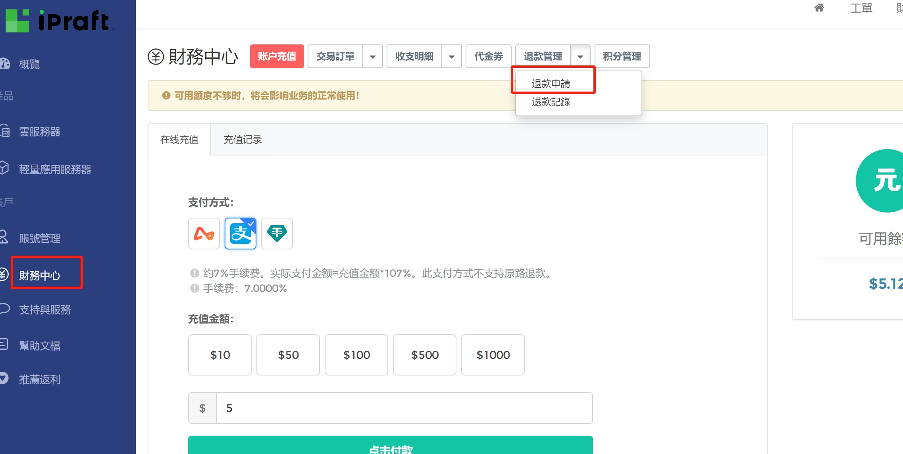

  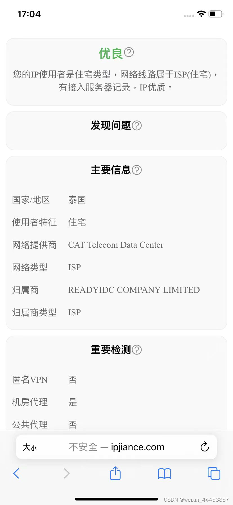

# 如果发现网络上不了就换端口号，然后重新扫码或者复制连接

  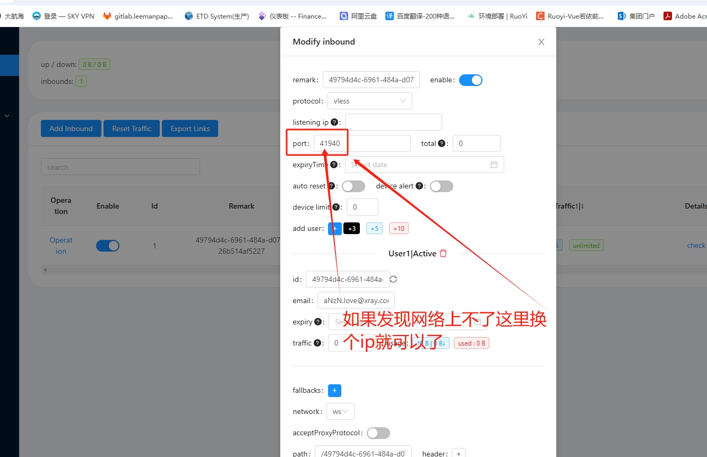

# 安卓用的上网软件 v2ray ,然后扫二维码连接
下载地址：https://www.ptxz.com/soft/8723.htm

# 如果你网速慢可以开启BBR加速器

教程地址是：https://blog.51cto.com/xiangxisheng/4806558

执行这3条命令就好了
wget --no-check-certificate https://github.com/teddysun/across/raw/master/bbr.sh

chmod +x bbr.sh

./bbr.sh

最后 脚本会提示需要重启 VPS，输入 y 并回车后重启。

# Tiktok-VPS--IP-XUI-VPN
