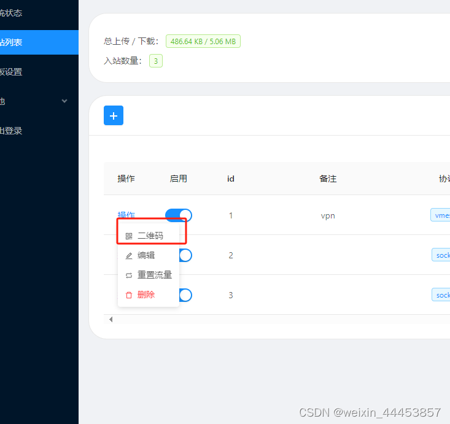

## 郑重申明：本文章只对合法合理做tiktok视频运营的用户做学习交流使用，有其他使用不当的违规违法行为后果自负！

## 1、视频安装演示地址
https://www.alipan.com/s/zheJQ3LBjJ5
提取码: 7ff1

# 购买服务器图片演示

1、选择服务器
我选择的服务器：https://ipraft.com/?i71b7cf

  

  

  

然后下载FinalShell连接你的虚拟器

下载地址（windows版本）是：http://www.hostbuf.com/downloads/finalshell_windows_x64.exe

其他版本下载地址是：FinalShell SSH工具,服务器管理,远程桌面加速软件,支持Windows,macOS,Linux,版本4.3.10,更新日期2023.12.31 - FinalShell官网

  

# 一、安装wget
# 由于新系统中没有wget，先安装wget

阿里云镜像库 https://mirrors.aliyun.com/centos/7.9.2009/os/x86_64/Packages

在该界面下载 wget-1.14-18.el7_6.1.x86_64.rpm

  

# 二、上传wget安装包到linux
创建对应文件夹：mkdir /home/wget

进入文件夹：cd /home/wget

三、将刚才下载的文件上传到该位置

# 安装wget
# 使用rpm安装wget：
rpm -ivh wget-1.14-18.el7_6.1.x86_64.rpm

# 四、安装yum

# 强制删除已安装程序及其关联
rpm -qa|grep python|xargs rpm -ev --allmatches --nodeps

# 删除所有残余文件 ##xargs，允许你对输出执行其他某些命令
whereis python |xargs rm -frv -rf

# 验证删除，返回无结果
whereis python

# 删除yum
rpm -qa|grep yum|xargs rpm -ev --allmatches --nodeps

whereis yum |xargs rm -frv -rf

# 创建安装包下载文件夹
mkdir /home/wget/rpm

进入文件夹：cd /home/wget/rpm

#  复制一下命令，等他下载完

wget https://mirrors.aliyun.com/centos/7.9.2009/os/x86_64/Packages/lvm2-python-libs-2.02.187-6.el7.x86_64.rpm
wget https://mirrors.aliyun.com/centos/7.9.2009/os/x86_64/Packages/libxml2-python-2.9.1-6.el7.5.x86_64.rpm
wget https://mirrors.aliyun.com/centos/7.9.2009/os/x86_64/Packages//python-libs-2.7.5-89.el7.x86_64.rpm
wget https://mirrors.aliyun.com/centos/7.9.2009/os/x86_64/Packages/python-ipaddress-1.0.16-2.el7.noarch.rpm
wget https://mirrors.aliyun.com/centos/7.9.2009/os/x86_64/Packages/python-backports-1.0-8.el7.x86_64.rpm
wget https://mirrors.aliyun.com/centos/7.9.2009/os/x86_64/Packages/python-backports-ssl_match_hostname-3.5.0.1-1.el7.noarch.rpm
wget https://mirrors.aliyun.com/centos/7.9.2009/os/x86_64/Packages/python-2.7.5-89.el7.x86_64.rpm
wget https://mirrors.aliyun.com/centos/7.9.2009/os/x86_64/Packages/python-iniparse-0.4-9.el7.noarch.rpm
wget https://mirrors.aliyun.com/centos/7.9.2009/os/x86_64/Packages/python-pycurl-7.19.0-19.el7.x86_64.rpm
wget https://mirrors.aliyun.com/centos/7.9.2009/os/x86_64/Packages/python-urlgrabber-3.10-10.el7.noarch.rpm
wget https://mirrors.aliyun.com/centos/7.9.2009/os/x86_64/Packages/python-setuptools-0.9.8-7.el7.noarch.rpm
wget https://mirrors.aliyun.com/centos/7.9.2009/os/x86_64/Packages/python-kitchen-1.1.1-5.el7.noarch.rpm
wget https://mirrors.aliyun.com/centos/7.9.2009/os/x86_64/Packages/python-chardet-2.2.1-3.el7.noarch.rpm
wget https://mirrors.aliyun.com/centos/7.9.2009/os/x86_64/Packages/rpm-python-4.11.3-45.el7.x86_64.rpm
wget https://mirrors.aliyun.com/centos/7.9.2009/os/x86_64/Packages/yum-utils-1.1.31-54.el7_8.noarch.rpm
wget https://mirrors.aliyun.com/centos/7.9.2009/os/x86_64/Packages/yum-3.4.3-168.el7.centos.noarch.rpm
wget https://mirrors.aliyun.com/centos/7.9.2009/os/x86_64/Packages/yum-metadata-parser-1.1.4-10.el7.x86_64.rpm
wget https://mirrors.aliyun.com/centos/7.9.2009/os/x86_64/Packages/yum-plugin-aliases-1.1.31-54.el7_8.noarch.rpm
wget https://mirrors.aliyun.com/centos/7.9.2009/os/x86_64/Packages/yum-plugin-protectbase-1.1.31-54.el7_8.noarch.rpm
wget https://mirrors.aliyun.com/centos/7.9.2009/os/x86_64/Packages/yum-plugin-fastestmirror-1.1.31-54.el7_8.noarch.rpm

# 安装替换依赖
rpm -ivh --nodeps --force *.rpm

# 测试yum
yum

# 删除yum源
rm -rf /etc/yum.repos.d/*

# 下载阿里云yum源
# 切换目录
cd /etc/yum.repos.d/

# 下载
wget http://mirrors.aliyun.com/repo/Centos-7.repo

# 清除缓存
yum clean all

# 生成缓存
yum makecache

# 安装X-UI面板命令
安装命令：  bash <(curl -Ls https://raw.githubusercontent.com/vaxilu/x-ui/master/install.sh)
英文版本：bash <(curl -Ls https://raw.githubusercontent.com/FranzKafkaYu/x-ui/master/install_en.sh)

要关闭防火墙，或者开通端口才能访问地址
对于使用firewalld的CentOS 8及以上版本：
停止防火墙服务:

sudo systemctl stop firewalld

禁用防火墙服务的自启动:

sudo systemctl disable firewalld

确认防火墙已关闭:

sudo systemctl status firewalld

安装完之后输入Y，账号，密码，端口，然后x-ui start （要关闭防火墙，或者开通端口才能访问地址）然后你的服务器ip加你的端口号，我的是7004

  

  

  

注意重要内容
三、手机端配置：最好是ios系统，基本思路就是把手机重置了把能共享、定位的功能都关了，再把手机的语言和时区设置成你想运营的那个地方的一致就行了。（手机端环境一定要配置好，环境不吻合视频容易限流或封号）尽量一个tk号一固定ip不要到处飘！ios手机不能插手机卡！

然后去地址测一下你的IP是否正常,输入你购买的服务器IP，如果显示ip不行可以退款，1天内可以退款，然后重新买，地址是：http://www.ipjiance.com

  

  

# 如果发现网络上不了就换端口号，然后重新扫码或者复制连接

  

# 安卓用的上网软件 v2ray ,然后扫二维码连接
下载地址：https://www.ptxz.com/soft/8723.htm

# 如果你网速慢可以开启BBR加速器

教程地址是：https://blog.51cto.com/xiangxisheng/4806558

执行这3条命令就好了
wget --no-check-certificate https://github.com/teddysun/across/raw/master/bbr.sh

chmod +x bbr.sh

./bbr.sh

最后 脚本会提示需要重启 VPS，输入 y 并回车后重启。

# Tiktok-VPS--IP-XUI-VPN
